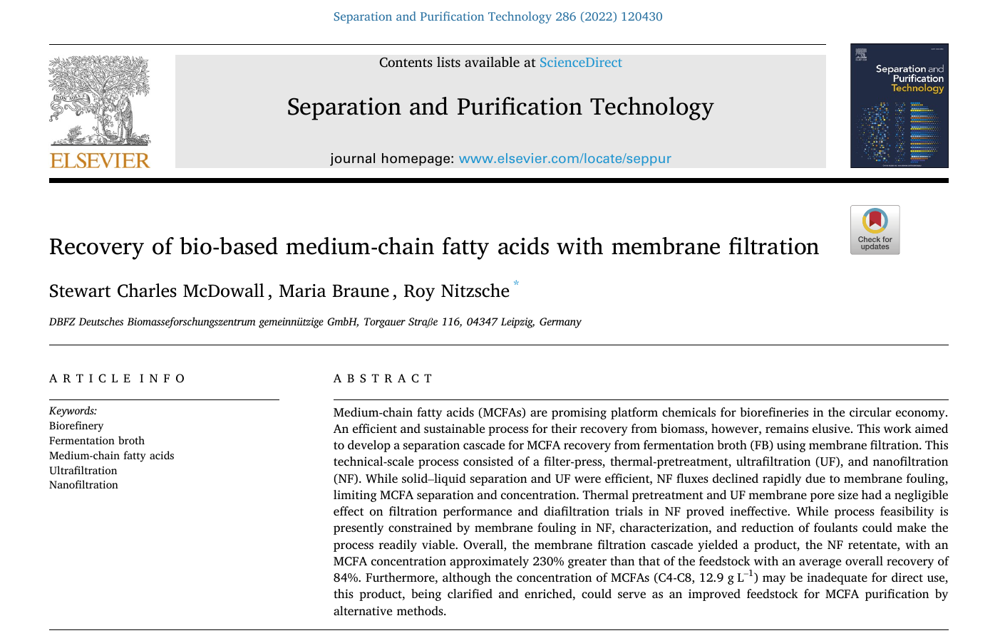
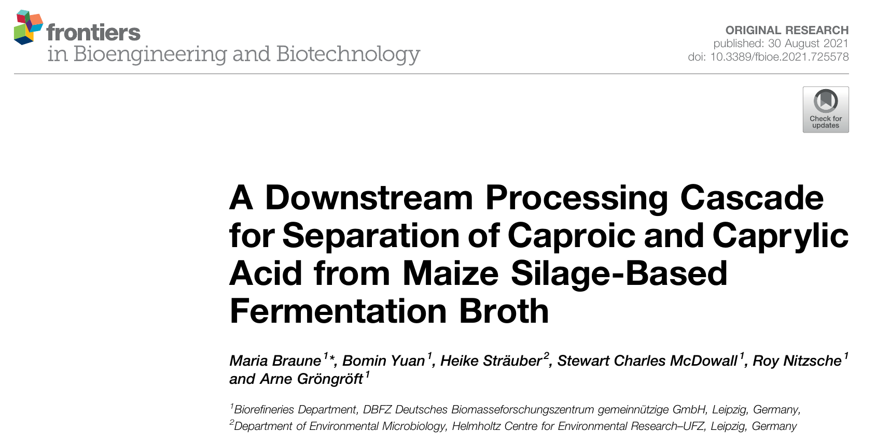
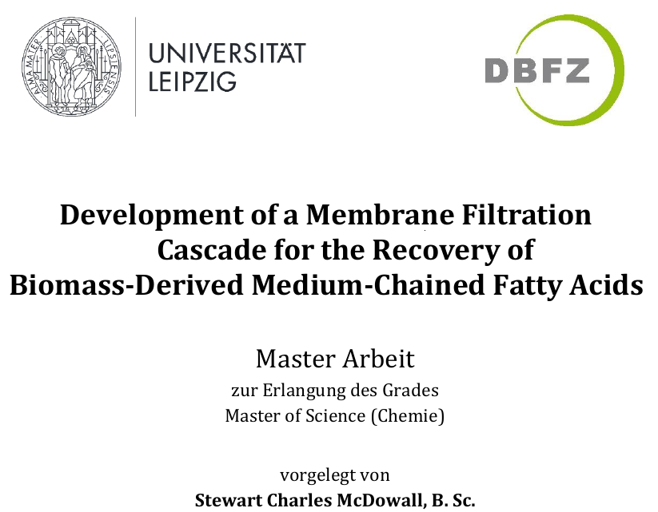
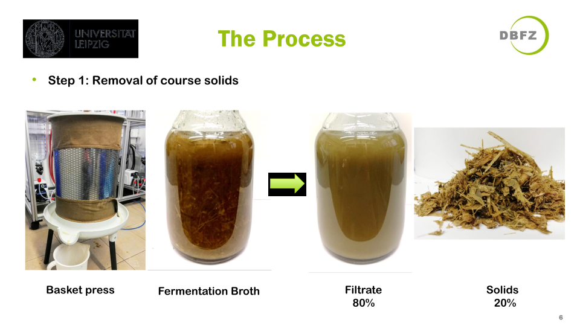
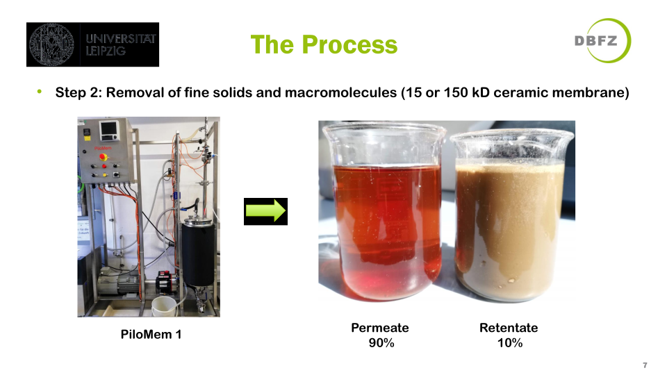
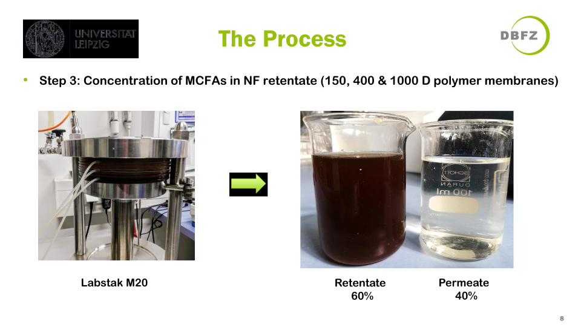
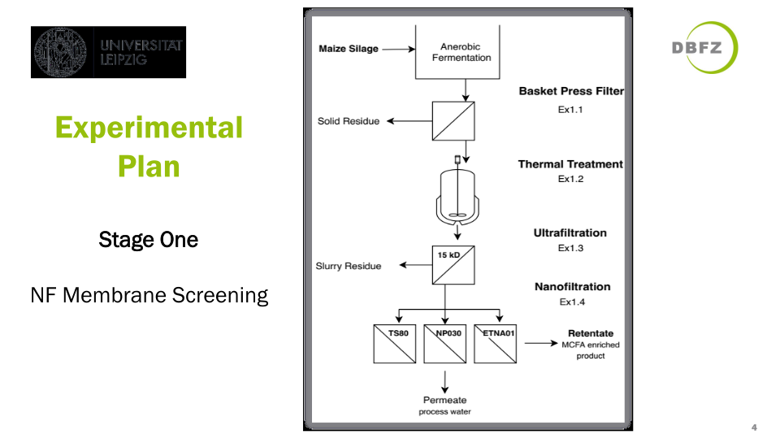
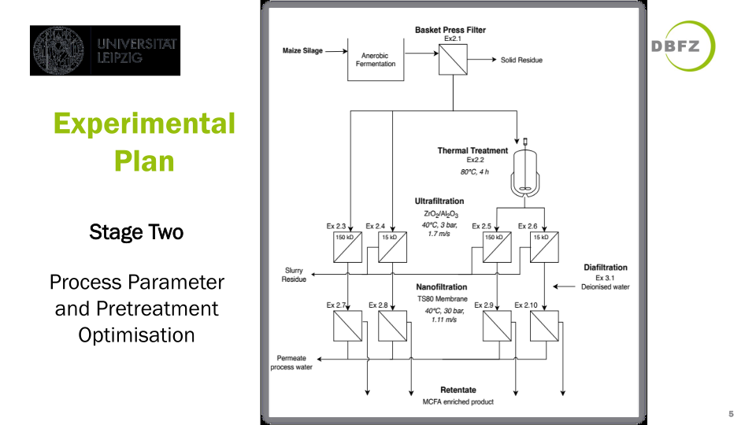

# SustainableProcessDevelopment

Publications and data from research on the recovery of medium-chain fatty acids with membrane filtration.  
Work conducted at the German Biomass Research Centre (DBFZ) in Leipzig, Germany and the University of Leipzig, Germany between 2019 and 2021.

## Contents

- [SustainableProcessDevelopment](#sustainableprocessdevelopment)
  - [Contents](#contents)
  - [*Recovery of bio-based medium-chain fatty acids with membrane filtration*](#recovery-of-bio-based-medium-chain-fatty-acids-with-membrane-filtration)
    - [Abstract](#abstract)
    - [Cite as](#cite-as)
  - [*A Downstream Processing Cascade for Separation of Caproic and Caprylic Acid from Maize Silage-Based Fermentation Broth*](#a-downstream-processing-cascade-for-separation-of-caproic-and-caprylic-acid-from-maize-silage-based-fermentation-broth)
    - [Abstract](#abstract-1)
    - [Cite as](#cite-as-1)
  - [*Development of a Membrane Filtration Cascade for the Recovery of Biomass-Derived Medium-Chained Fatty Acids*](#development-of-a-membrane-filtration-cascade-for-the-recovery-of-biomass-derived-medium-chained-fatty-acids)
    - [Abstract](#abstract-2)
    - [Cite as](#cite-as-2)
  - [*Presentation of results*](#presentation-of-results)

## *Recovery of bio-based medium-chain fatty acids with membrane filtration*

Paper by  
Stewart Charles McDowall, Maria Braune, Roy Nitzsche  
Separation and Purification Technology, 2022

[PDF](McDowallSC_2022_Recovery_of_bio-based_medium-chain_fatty_acids_with_membrane_filtration.pdf)

  

### Abstract

Medium-chain fatty acids (MCFAs) are promising platform chemicals for biorefineries in the circular economy. An efficient and sustainable process for their recovery from biomass, however, remains elusive. This work aimed to develop a separation cascade for MCFA recovery from fermentation broth (FB) using membrane filtration. This technical-scale process consisted of a filter-press, thermal-pretreatment, ultrafiltration (UF), and nanofiltration (NF). While solid-liquid separation and UF were efficient, NF fluxes declined rapidly due to membrane fouling, limiting MCFA separation and concentration. Thermal pretreatment and UF membrane pore size had a negligible effect on filtration performance and diafiltration trials in NF proved ineffective. While process feasibility is presently constrained by membrane fouling in NF, characterization, and reduction of foulants could make the process readily viable. Overall, the membrane filtration cascade yielded a product, the NF retentate, with an MCFA concentration approximately 230% greater than that of the feedstock with an average overall recovery of 84%. Furthermore, although the concentration of MCFAs (C4-C8, 12.9 g L–1) may be inadequate for direct use, this product, being clarified and enriched, could serve as an improved feedstock for MCFA purification by alternative methods.

### Cite as

@article{mcdowall2022mcfa,  
title = {Recovery of bio-based medium-chain fatty acids with membrane filtration},  
journal = {Separation and Purification Technology},  
author = {Stewart Charles McDowall and Maria Braune and Roy Nitzsche},  
volume = {286},  
pages = {120430},  
year = {2022},  
issn = {1383-5866},  
doi = {<https://doi.org/10.1016/j.seppur.2021.120430}>,  
url = {<https://www.sciencedirect.com/science/article/pii/S1383586621021341}>,  
keywords = {Biorefinery, Fermentation broth, Medium-chain fatty acids, Ultrafiltration, Nanofiltration},  
}

## *A Downstream Processing Cascade for Separation of Caproic and Caprylic Acid from Maize Silage-Based Fermentation Broth*

Paper by  
Maria Braune, Bomin Yuan, Heike Sträuber, Stewart Charles McDowall, Roy Nitzsche, Arne Gröngröft  

Frontiers in Bioengineering and Biotechnology, 2021

[PDF](BrauneM_2021_A_Downstream_Processing_Cascade_for_Separation_of_Caproic_and_Caprylic_Acid_from_Maize_Silage-Based_Fermentation_Broth.pdf)  

### Abstract

Production of caproic and caprylic acid through anaerobic fermentation of crops or residual and waste biomass has been regarded as an alternative to the conventional ways, where plant oils and animal fats are mostly used. The downstream processing of the fermentation broth is a particular challenge since the broth has a highly complex composition and low concentrations of the target products. In this study, the proof-of-principle for a separation cascade for caproic (C6) and caprylic acid (C8) produced in a maize silage-based fermentation process was demonstrated. For clarification of the fermentation broth, a filter press and a ceramic ultrafiltration membrane was used to remove coarse solids and to separate suspended particles and macromolecules from the fermentation broth, respectively. With both techniques, the dry matter content was reduced from 6.8 to 2.3% and a particle-free product solution was obtained. Subsequently, the carboxylic acids were extracted with oleyl alcohol by liquid-liquid extraction with an extraction efficiency of 85% for C6 and 97% for C8. Over the whole cascade, 58% of caproic acid and 66% of caprylic acid were recovered from the fermentation broth into the extract. Among all separation steps, solid-liquid separation with the filter press caused the major part of the product loss of 21% of each carboxylic acid. By using separation equipment with a better solid separation efficiency such as decanter centrifuges or belt filter presses this loss could be minimized.

### Cite as

@article{braune2021mcfa,  
author={Braune, Maria and Yuan, Bomin and Sträuber, Heike and McDowall, Stewart Charles and Nitzsche, Roy and Gröngröft, Arne},  
title={A Downstream Processing Cascade for Separation of Caproic and Caprylic Acid from Maize Silage-Based Fermentation Broth}  
journal={Frontiers in Bioengineering and Biotechnology},  
volume={9},  
year={2021},  
url={<https://www.frontiersin.org/articles/10.3389/fbioe.2021.725578}>,  
doi={10.3389/fbioe.2021.725578},  
issn={2296-4185},  
}

## *Development of a Membrane Filtration Cascade for the Recovery of Biomass-Derived Medium-Chained Fatty Acids*  

Master's thesis by  
Stewart Charles McDowall  
German Biomass Research Centre (DBFZ) and University of Leipzig, Germany, 2020

[PDF](MasterThesis_2020_StewartCharlesMcDowall_RecoveryofMCFAswithMembraneFiltration.pdf)  

### Abstract  

In this study, a separation cascade was developed for the recovery of
medium-chained fatty acids (MCFAs) from fermentation broth (FB) using
membrane technologies. The MCFAs were produced by the fermentation of maize
silage in a mixed-culture chain-elongation process. The separation cascade
consists of a basket press for solid-liquid separation, ultrafiltration (UF) for the
removal of suspended solids and macromolecules, and nanofiltration (NF) to
concentrate the MCFAs. Two ceramic UF membranes and three polymeric flat-
sheet NF membranes were trialled in a technical-scale crossflow filtration.
Investigations to establish the ideal process conditions were based on yield, flux
and energy expenditure and included: thermal pretreatment, filtration
parameter studies, UF and NF membrane screening, diafiltration, and membrane
fouling analysis. In UF, permeate fluxes of >50 kg m-2 h-1 and volume reductions
of ~0.9 were achieved. Pretreatment and membrane pore size had no
considerable influence on permeate flux and the limiting factor was concluded to
be the formation of a cake layer on the membrane surface. In NF, volume
reductions of >0.6 were attained, and the Tricep TS80 membrane had the highest
MCFA retentions (>90%). Although initial NF permeate fluxes with this
membrane were high (60-80 kg m-2 h-1), flux decline due to membrane fouling
occurred rapidly, and near-total blockage limited the final concentration of
MCFAs. While direct industrial application is restricted by the inadequate MCFA
concentration, characterisation and reduction of NF membrane foulants could
make this process viable. As it stands, this membrane filtration cascade provides
an improved feedstock for the final purification of MCFAs by extraction or
distillation.

### Cite as

@thesis{mcdowall2020mcfathesis,  
author = {McDowall, Stewart Charles},  
title = {Development of a Membrane Filtration Cascade for the Recovery of Biomass-Derived Medium-Chained Fatty Acids},  
school = {University of Leipzig},  
year = {2020},  
address = {Leipzig, Germany},  
note = {German Biomass Research Centre (DBFZ)},
url = {<https://doi.org/10.5281/zenodo.3930504}>,  
doi = {10.5281/zenodo.3930504},  
}

## *Presentation of results*

See the [PDF of the full presentation](Presentation_2021_StewartCharlesMcDowall_RecoveryofMCFAswithMembraneFiltration.pdf) here for more detail, photos, flowcharts of the work.

 Below are some extracts.  

